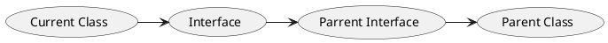

## Approaches

* new
* Reflect
    * Class.newInstance
    * Constructor.newInstance
* clone
* Deserialize

## Flow

* class load
    * compile
    * load
    * link
        * validate
        * prepare
        * resolve
    * init
    * use
    * unload

* mem alloc
* init zero value
* set object header
* `init` -> constructor

## Class Loading

* class access
    * static member
    * reflect
    * force loading
        * Class.forName
        * ClassLoader.loadClass
* instance access

---
