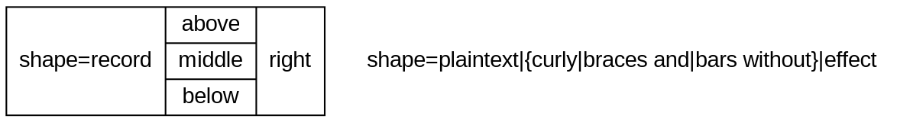
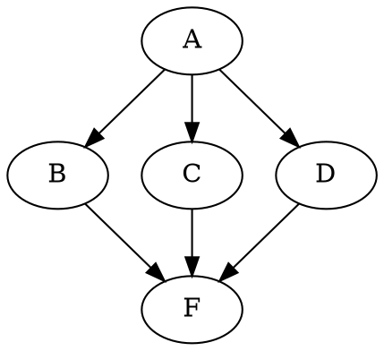
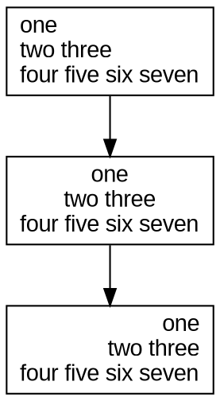
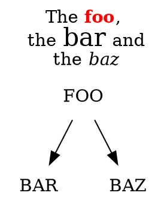
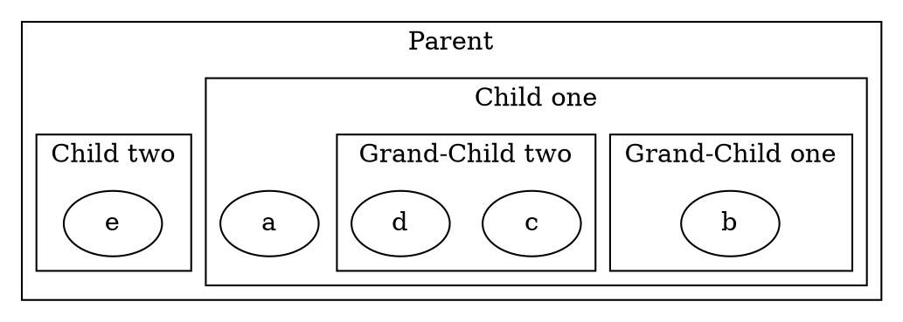
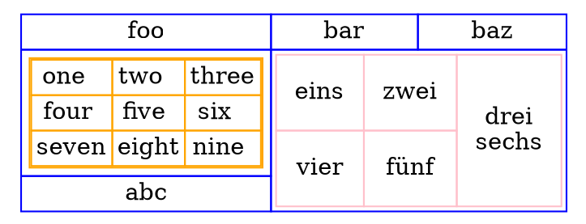

# Graphviz

```graphviz
digraph D {

    node [fontname="Arial"];

    node_A [shape=record    label="shape=record|{above|middle|below}|right"];
    node_B [shape=plaintext label="shape=plaintext|{curly|braces and|bars without}|effect"];


}
```

```graphviz
digraph D {

  A -> {B, C, D} -> {F}

}
```

```graphviz
digraph L {

  node [shape=record fontname=Arial];

  a  [label="one\ltwo three\lfour five six seven\l"]
  b  [label="one\ntwo three\nfour five six seven"]
  c  [label="one\rtwo three\rfour five six seven\r"]

  a -> b -> c

}
```

```graphviz
digraph D {

  label = <The <font color='red'><b>foo</b></font>,<br/> the <font point-size='20'>bar</font> and<br/> the <i>baz</i>>;
  labelloc = "t"; // place the label at the top (b seems to be default)

  node [shape=plaintext]

  FOO -> {BAR, BAZ};

}
```

```graphviz
digraph D {

  subgraph cluster_p {
    label = "Parent";

    subgraph cluster_c1 {
      label = "Child one";
      a;

      subgraph cluster_gc_1 {
        label = "Grand-Child one";
         b;
      }
      subgraph cluster_gc_2 {
        label = "Grand-Child two";
          c;
          d;
      }

    }

    subgraph cluster_c2 {
      label = "Child two";
      e;
    }
  }
}
```

```graphviz
digraph {

  tbl [

    shape=plaintext
    label=<

      <table border='0' cellborder='1' color='blue' cellspacing='0'>
        <tr><td>foo</td><td>bar</td><td>baz</td></tr>
        <tr><td cellpadding='4'>
          <table color='orange' cellspacing='0'>
            <tr><td>one  </td><td>two  </td><td>three</td></tr>
            <tr><td>four </td><td>five </td><td>six  </td></tr>
            <tr><td>seven</td><td>eight</td><td>nine </td></tr>
          </table>
        </td>
        <td colspan='2' rowspan='2'>
          <table color='pink' border='0' cellborder='1' cellpadding='10' cellspacing='0'>
            <tr><td>eins</td><td>zwei</td><td rowspan='2'>drei<br/>sechs</td></tr>
            <tr><td>vier</td><td>fünf</td>                             </tr>
          </table>
        </td> 
        </tr>

        <tr><td>abc</td></tr>

      </table>

    >];

}
```

[more official examples](https://renenyffenegger.ch/notes/tools/Graphviz/examples/index)
