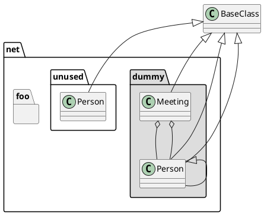

@startuml
class foo
foo --> bar : normal
foo --> bar1 #line:red;line.bold;text:red  : red bold
foo --> bar2 #green;line.dashed;text:green : green dashed 
foo --> bar3 #blue;line.dotted;text:blue   : blue dotted
@enduml

