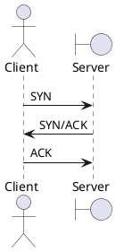

* three-way handshake

```puml
@startuml

actor Client as c
boundary Server as s

c -> s: SYN
s -> c: SYN/ACK
c -> s: ACK

@enduml
```

* Server
    * CLOSED
    * LISTEN
    * SYN_RCVD
    * ESTABLISHED

* Client
    * CLOSED
    * SYN_SENT
    * ESTABLISHED

---
