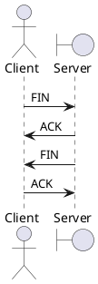

* can not send FIN and ACK together

---

* Client
    * ESTABLISHED
    * FIN_WAIT_1
    * FIN_WAIT_2
    * TIME_WAIT
    * CLOSED

* Server
    * ESTABLISHED
    * CLOSE_WAIT
    * LAST_ACK
    * CLOSED

---

## 为什么挥手需要 4 次 ？

* 由于 TCP 连接 `全双工`
    * 因此，每个方向的连接必须单独关闭

* 主动发起关闭的一方，表示这一方已不需要发送数据
    * 半关闭（half-close）

* 被动关闭的一方，并不是收到 FIN 后立刻回 FIN + ACK
    * 先只回 ACK
    * 被动方也确保结束全部数据发送后，才发送 FIN

---

## 主动关闭方为何需要 TIME_WAIT 后，才进入 CLOSED 状态 ？

* 网络不稳定，避免主动关闭方最后回复的 ACK 丢失
    * 被动方未及时收到 ACK ，会重发 FIN
    * TIME_WAIT 确保可以接收被动方重发的 FIN
        * 重新回复 ACK

* ACK 重发期间，持续 TIME_WAIT 继续占用连接四元组
    * 四元组
        * local IP
        * local port
        * remote IP
        * remote port
    * 避免重发的 FIN 及 ACK 干扰同一四元组建立的新连接
        * 所以 TIME_WAIT 占用，避免立即新建

---
