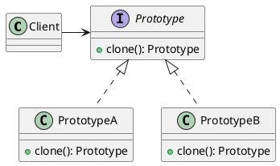

[Home](https://mengxianbin.github.io) /
[cs-notes](https://mengxianbin.github.io/cs-notes/content) /
[Design](https://mengxianbin.github.io/cs-notes/content/Design) /
[Design Patterns](https://mengxianbin.github.io/cs-notes/content/Design/Design%20Patterns) /
[Creational Patterns](https://mengxianbin.github.io/cs-notes/content/Design/Design%20Patterns/Creational%20Patterns) /
[Others](https://mengxianbin.github.io/cs-notes/content/Design/Design%20Patterns/Creational%20Patterns/Others) /
[Prototype](https://mengxianbin.github.io/cs-notes/content/Design/Design%20Patterns/Creational%20Patterns/Others/Prototype)

