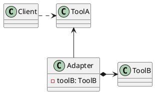

[Home](https://mengxianbin.github.io) /
[cs-notes](https://mengxianbin.github.io/cs-notes/content) /
[Design](https://mengxianbin.github.io/cs-notes/content/Design) /
[Design Patterns](https://mengxianbin.github.io/cs-notes/content/Design/Design%20Patterns) /
[Structural Patterns](https://mengxianbin.github.io/cs-notes/content/Design/Design%20Patterns/Structural%20Patterns) /
[Adapter](https://mengxianbin.github.io/cs-notes/content/Design/Design%20Patterns/Structural%20Patterns/Adapter)

## Examples

* java.io
    * InputStream
    * OutputStream

---
