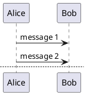

[Home](https://mengxianbin.github.io) /
[cs-notes](https://mengxianbin.github.io/cs-notes/content) /
[Design](https://mengxianbin.github.io/cs-notes/content/Design) /
[UML](https://mengxianbin.github.io/cs-notes/content/Design/UML) /
[Tools](https://mengxianbin.github.io/cs-notes/content/Design/UML/Tools) /
[PlantUML](https://mengxianbin.github.io/cs-notes/content/Design/UML/Tools/PlantUML)

