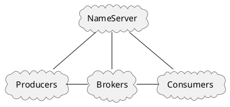
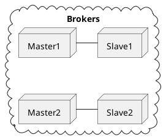

[Home](https://mengxianbin.github.io) /
[cs-notes](https://mengxianbin.github.io/cs-notes/site) /
[Architecture](https://mengxianbin.github.io/cs-notes/site/Architecture) /
[Components](https://mengxianbin.github.io/cs-notes/site/Architecture/Components) /
[Message Queue](https://mengxianbin.github.io/cs-notes/site/Architecture/Components/Message%20Queue) /
[RocketMQ](https://mengxianbin.github.io/cs-notes/site/Architecture/Components/Message%20Queue/RocketMQ) /
[Deploy](https://mengxianbin.github.io/cs-notes/site/Architecture/Components/Message%20Queue/RocketMQ/Deploy) /
[Physical](https://mengxianbin.github.io/cs-notes/site/Architecture/Components/Message%20Queue/RocketMQ/Deploy/Physical)

