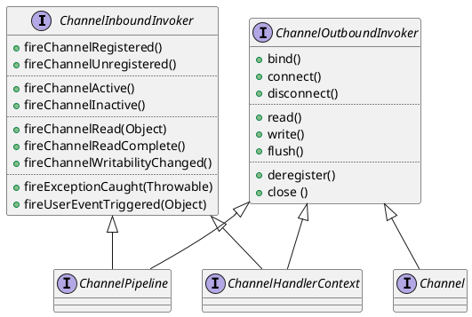

[Home](https://mengxianbin.github.io) /
[cs-notes](https://mengxianbin.github.io/cs-notes/site) /
[Architecture](https://mengxianbin.github.io/cs-notes/site/Architecture) /
[Components](https://mengxianbin.github.io/cs-notes/site/Architecture/Components) /
[Netty](https://mengxianbin.github.io/cs-notes/site/Architecture/Components/Netty) /
[All](https://mengxianbin.github.io/cs-notes/site/Architecture/Components/Netty/All) /
[Invoker](https://mengxianbin.github.io/cs-notes/site/Architecture/Components/Netty/All/Invoker)

