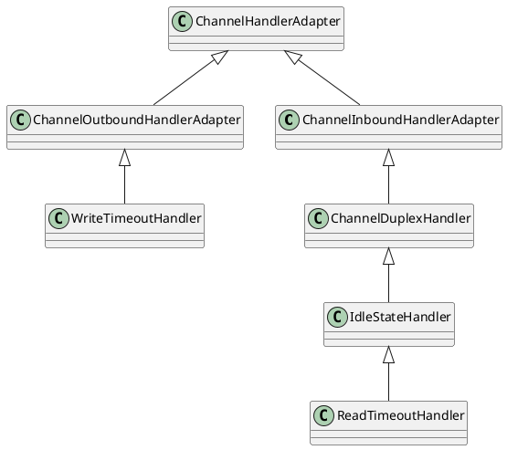
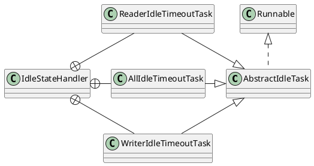

[Home](https://mengxianbin.github.io) /
[cs-notes](https://mengxianbin.github.io/cs-notes/site) /
[Architecture](https://mengxianbin.github.io/cs-notes/site/Architecture) /
[Components](https://mengxianbin.github.io/cs-notes/site/Architecture/Components) /
[Netty](https://mengxianbin.github.io/cs-notes/site/Architecture/Components/Netty) /
[Handler](https://mengxianbin.github.io/cs-notes/site/Architecture/Components/Netty/Handler) /
[timeout](https://mengxianbin.github.io/cs-notes/site/Architecture/Components/Netty/Handler/timeout) /
[Hierarchy](https://mengxianbin.github.io/cs-notes/site/Architecture/Components/Netty/Handler/timeout/Hierarchy)

---

