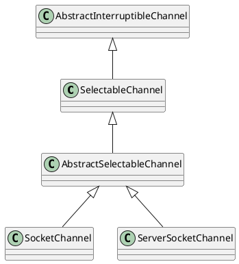

[Home](https://mengxianbin.github.io) /
[cs-notes](https://mengxianbin.github.io/cs-notes/site) /
[Architecture](https://mengxianbin.github.io/cs-notes/site/Architecture) /
[Components](https://mengxianbin.github.io/cs-notes/site/Architecture/Components) /
[Netty](https://mengxianbin.github.io/cs-notes/site/Architecture/Components/Netty) /
[Java](https://mengxianbin.github.io/cs-notes/site/Architecture/Components/Netty/Java) /
[AbstractInterruptableChannel](https://mengxianbin.github.io/cs-notes/site/Architecture/Components/Netty/Java/AbstractInterruptableChannel) /
[Hierarchy](https://mengxianbin.github.io/cs-notes/site/Architecture/Components/Netty/Java/AbstractInterruptableChannel/Hierarchy)

