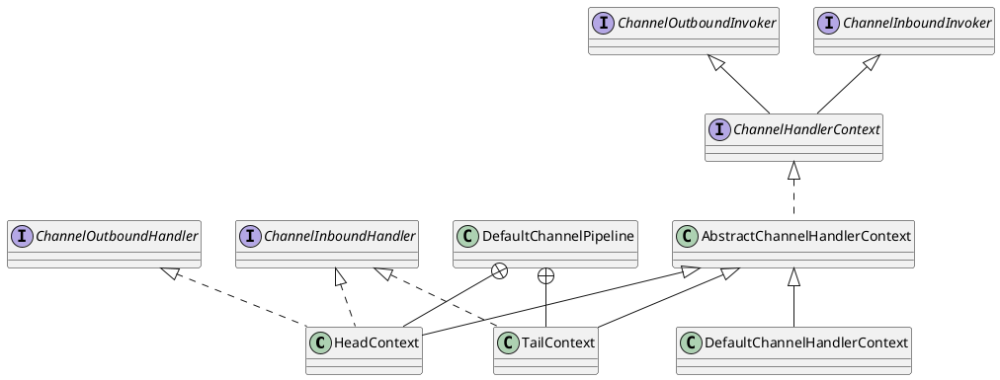

[Home](https://mengxianbin.github.io) /
[cs-notes](https://mengxianbin.github.io/cs-notes/site) /
[Architecture](https://mengxianbin.github.io/cs-notes/site/Architecture) /
[Components](https://mengxianbin.github.io/cs-notes/site/Architecture/Components) /
[Netty](https://mengxianbin.github.io/cs-notes/site/Architecture/Components/Netty) /
[Pipeline](https://mengxianbin.github.io/cs-notes/site/Architecture/Components/Netty/Pipeline) /
[DefaultChannelPipeline](https://mengxianbin.github.io/cs-notes/site/Architecture/Components/Netty/Pipeline/DefaultChannelPipeline) /
[Hierarchy](https://mengxianbin.github.io/cs-notes/site/Architecture/Components/Netty/Pipeline/DefaultChannelPipeline/Hierarchy)

