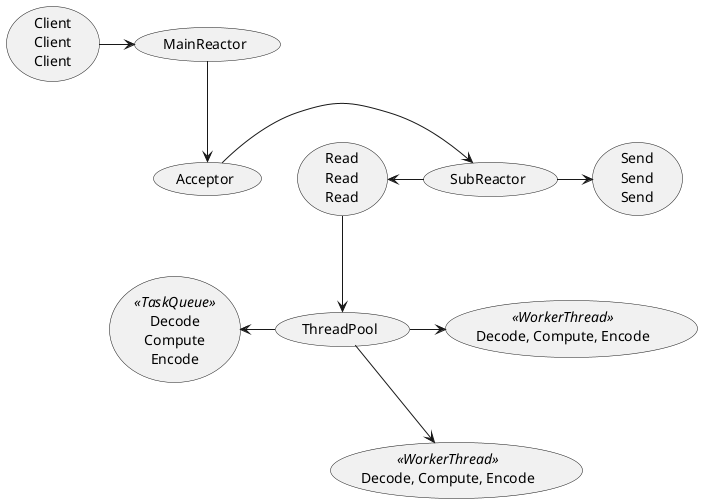

[Home](https://mengxianbin.github.io) /
[cs-notes](https://mengxianbin.github.io/cs-notes/site) /
[Architecture](https://mengxianbin.github.io/cs-notes/site/Architecture) /
[Components](https://mengxianbin.github.io/cs-notes/site/Architecture/Components) /
[Netty](https://mengxianbin.github.io/cs-notes/site/Architecture/Components/Netty) /
[Reactor](https://mengxianbin.github.io/cs-notes/site/Architecture/Components/Netty/Reactor) /
[Netty](https://mengxianbin.github.io/cs-notes/site/Architecture/Components/Netty/Reactor/Netty) /
[Main-Sub Reactors](https://mengxianbin.github.io/cs-notes/site/Architecture/Components/Netty/Reactor/Netty/Main-Sub%20Reactors)

