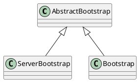

[Home](https://mengxianbin.github.io) /
[cs-notes](https://mengxianbin.github.io/cs-notes/site) /
[Architecture](https://mengxianbin.github.io/cs-notes/site/Architecture) /
[Netty](https://mengxianbin.github.io/cs-notes/site/Architecture/Netty) /
[Bootstrap](https://mengxianbin.github.io/cs-notes/site/Architecture/Netty/Bootstrap) /
[Hierarchy](https://mengxianbin.github.io/cs-notes/site/Architecture/Netty/Bootstrap/Hierarchy)

