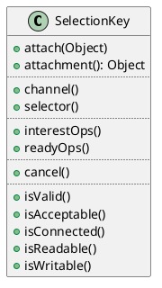

[Home](https://mengxianbin.github.io) /
[cs-notes](https://mengxianbin.github.io/cs-notes/site) /
[Architecture](https://mengxianbin.github.io/cs-notes/site/Architecture) /
[Netty](https://mengxianbin.github.io/cs-notes/site/Architecture/Netty) /
[Java](https://mengxianbin.github.io/cs-notes/site/Architecture/Netty/Java) /
[SelectionKey](https://mengxianbin.github.io/cs-notes/site/Architecture/Netty/Java/SelectionKey) /
[SelectionKey](https://mengxianbin.github.io/cs-notes/site/Architecture/Netty/Java/SelectionKey/SelectionKey)

