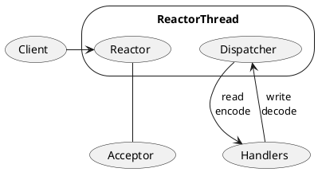

[Home](https://mengxianbin.github.io) /
[cs-notes](https://mengxianbin.github.io/cs-notes/site) /
[Architecture](https://mengxianbin.github.io/cs-notes/site/Architecture) /
[Netty](https://mengxianbin.github.io/cs-notes/site/Architecture/Netty) /
[Reactor](https://mengxianbin.github.io/cs-notes/site/Architecture/Netty/Reactor) /
[Netty](https://mengxianbin.github.io/cs-notes/site/Architecture/Netty/Reactor/Netty) /
[Single Thread](https://mengxianbin.github.io/cs-notes/site/Architecture/Netty/Reactor/Netty/Single%20Thread)

