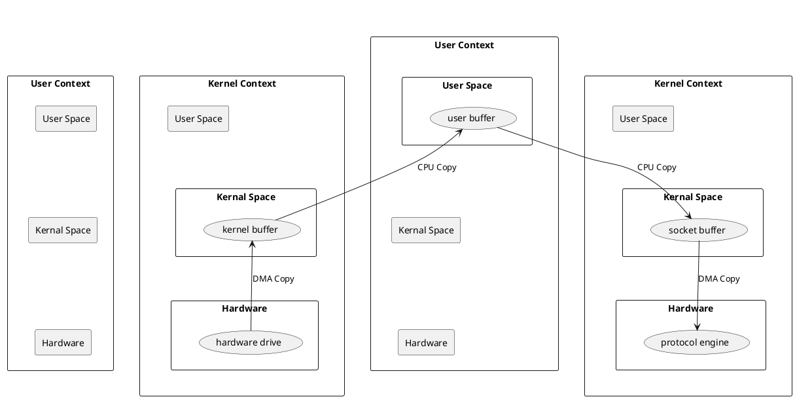

[Home](https://mengxianbin.github.io) /
[cs-notes](https://mengxianbin.github.io/cs-notes/site) /
[Architecture](https://mengxianbin.github.io/cs-notes/site/Architecture) /
[Netty](https://mengxianbin.github.io/cs-notes/site/Architecture/Netty) /
[Summary](https://mengxianbin.github.io/cs-notes/site/Architecture/Netty/Summary) /
[Zero Copy](https://mengxianbin.github.io/cs-notes/site/Architecture/Netty/Summary/Zero%20Copy) /
[classic](https://mengxianbin.github.io/cs-notes/site/Architecture/Netty/Summary/Zero%20Copy/classic)

---

* do copy: 4 times
* switch context: 3 times

---
