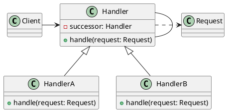

[Home](https://mengxianbin.github.io) /
[cs-notes](https://mengxianbin.github.io/cs-notes/site) /
[Design](https://mengxianbin.github.io/cs-notes/site/Design) /
[Design Patterns](https://mengxianbin.github.io/cs-notes/site/Design/Design%20Patterns) /
[Behavioral Patterns](https://mengxianbin.github.io/cs-notes/site/Design/Design%20Patterns/Behavioral%20Patterns) /
[Chain Of Responsibility](https://mengxianbin.github.io/cs-notes/site/Design/Design%20Patterns/Behavioral%20Patterns/Chain%20Of%20Responsibility)

## Examples

* java.lang.ClassLoader
* DNS server - domain resolve

---
