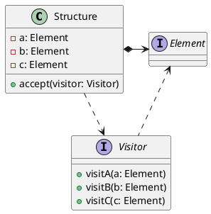

[Home](https://mengxianbin.github.io) /
[cs-notes](https://mengxianbin.github.io/cs-notes/site) /
[Design](https://mengxianbin.github.io/cs-notes/site/Design) /
[Design Patterns](https://mengxianbin.github.io/cs-notes/site/Design/Design%20Patterns) /
[Behavioral Patterns](https://mengxianbin.github.io/cs-notes/site/Design/Design%20Patterns/Behavioral%20Patterns) /
[Others](https://mengxianbin.github.io/cs-notes/site/Design/Design%20Patterns/Behavioral%20Patterns/Others) /
[Visitor](https://mengxianbin.github.io/cs-notes/site/Design/Design%20Patterns/Behavioral%20Patterns/Others/Visitor)

## Intent

* Seperate an algorithm from a structure on which it operates.
    * Add new oprations without modifying the structure.

## Principles

* Open-closed Principle

---
