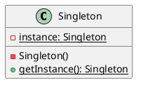
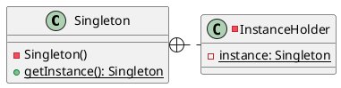
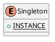

[Home](https://mengxianbin.github.io) /
[cs-notes](https://mengxianbin.github.io/cs-notes/site) /
[Design](https://mengxianbin.github.io/cs-notes/site/Design) /
[Design Patterns](https://mengxianbin.github.io/cs-notes/site/Design/Design%20Patterns) /
[Creational Patterns](https://mengxianbin.github.io/cs-notes/site/Design/Design%20Patterns/Creational%20Patterns) /
[Singleton](https://mengxianbin.github.io/cs-notes/site/Design/Design%20Patterns/Creational%20Patterns/Singleton)

# Singleton

## Solution

* Simple

* Inner Class

* Enumeration

## Issues

* Thread Safe
    * volatile
    * synchronized

* Uniqueness
    * Class Load
    * Clone
    * Reflect
    * Deserialize

---
