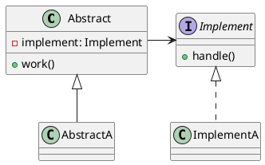

[Home](https://mengxianbin.github.io) /
[cs-notes](https://mengxianbin.github.io/cs-notes/site) /
[Design](https://mengxianbin.github.io/cs-notes/site/Design) /
[Design Patterns](https://mengxianbin.github.io/cs-notes/site/Design/Design%20Patterns) /
[Structural Patterns](https://mengxianbin.github.io/cs-notes/site/Design/Design%20Patterns/Structural%20Patterns) /
[Bridge](https://mengxianbin.github.io/cs-notes/site/Design/Design%20Patterns/Structural%20Patterns/Bridge)

