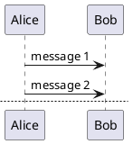
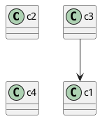
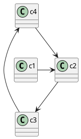
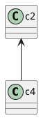
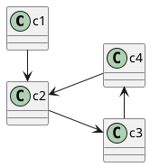
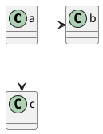

[Home](https://mengxianbin.github.io) /
[cs-notes](https://mengxianbin.github.io/cs-notes/site) /
[Design](https://mengxianbin.github.io/cs-notes/site/Design) /
[UML](https://mengxianbin.github.io/cs-notes/site/Design/UML) /
[Tools](https://mengxianbin.github.io/cs-notes/site/Design/UML/Tools) /
[PlantUML](https://mengxianbin.github.io/cs-notes/site/Design/UML/Tools/PlantUML)


* [Official](https://plantuml.com/)

* [Download](https://plantuml.com/zh/download)

* [GitHub](https://github.com/plantuml/plantuml)

* [Playground](https://www.planttext.com/)

* Example



---

## Layout

#### [Controlling Class Layout](https://isgb.otago.ac.nz/infosci/mark.george/templates/blob/8e98805c117c7b2e9b9f545c47b50366bb644e5e/plantuml/class-diagram-tips.md)

> 1

```puml
' force class diagram mode
class c1
 
' horizontal placement
c1 -> c2
 
' vertical placement
c2 --> c3
 
' left placement
c1 -left-> c4
```

> 2

```puml
class c4

c1 --> c2

' link will not affect class placement
' c4 --> c2
c4 -[norank]-> c2
```

> 3



> 4

```puml
@startuml

class c2

' place c2 and c4 closer
c2 -[hidden]- c4
       
' draw the actual link between the hidden links
c2 <-[norank]- c4
    
' place c2 and c4 even closer
c2 -[hidden]- c4

@enduml
```



##### General Layout Tips

> 5



> 6

```puml
@startuml

class c2

' ranking maintained, so layout isn't dramatically affected
' arrow drawn at opposite end to account for reverse order
c2 <-- c4

@enduml
```



> 7



##### Layout Direction

> 8



##### Spacing

> 9



---
