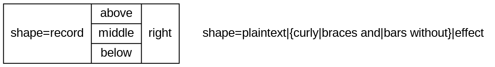
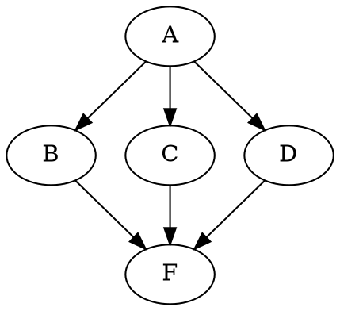
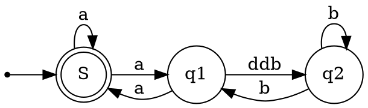
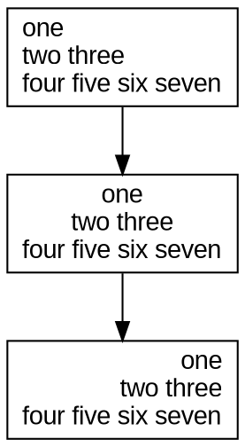
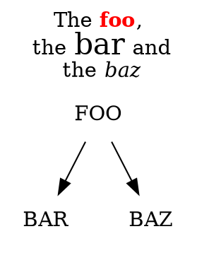
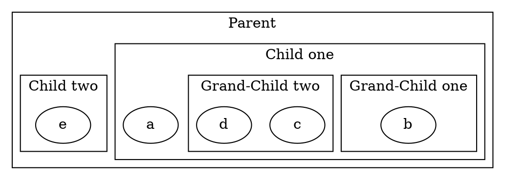

[Home](https://mengxianbin.github.io) /
[cs-notes](https://mengxianbin.github.io/cs-notes/site) /
[Language](https://mengxianbin.github.io/cs-notes/site/Language) /
[Markdown](https://mengxianbin.github.io/cs-notes/site/Language/Markdown) /
[graphviz](https://mengxianbin.github.io/cs-notes/site/Language/Markdown/graphviz)

# Graphviz

```graphviz
digraph {

  tbl [

    shape=plaintext
    label=<

      <table border='0' cellborder='1' color='blue' cellspacing='0'>
        <tr><td>foo</td><td>bar</td><td>baz</td></tr>
        <tr><td cellpadding='4'>
          <table color='orange' cellspacing='0'>
            <tr><td>one  </td><td>two  </td><td>three</td></tr>
            <tr><td>four </td><td>five </td><td>six  </td></tr>
            <tr><td>seven</td><td>eight</td><td>nine </td></tr>
          </table>
        </td>
        <td colspan='2' rowspan='2'>
          <table color='pink' border='0' cellborder='1' cellpadding='10' cellspacing='0'>
            <tr><td>eins</td><td>zwei</td><td rowspan='2'>drei<br/>sechs</td></tr>
            <tr><td>vier</td><td>fünf</td>                             </tr>
          </table>
        </td> 
        </tr>

        <tr><td>abc</td></tr>

      </table>

    >];

}
```

[more official examples](https://renenyffenegger.ch/notes/tools/Graphviz/examples/index)

