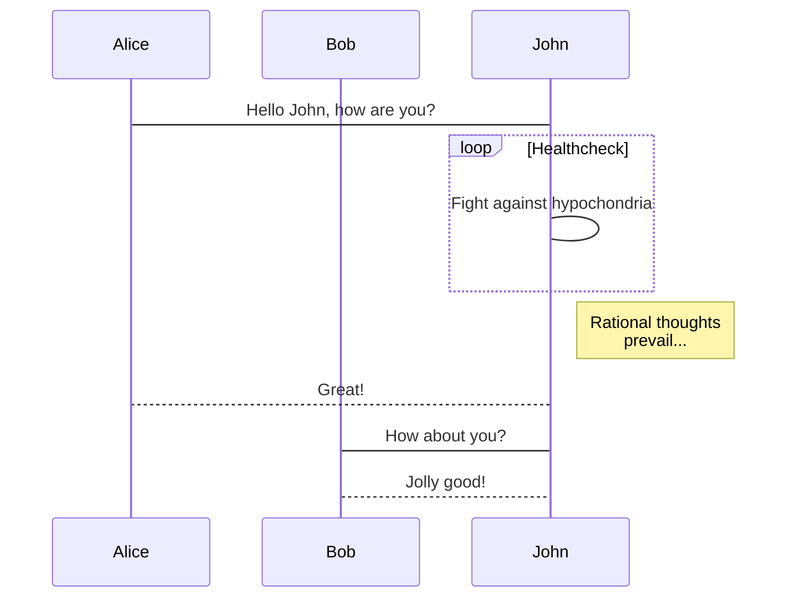
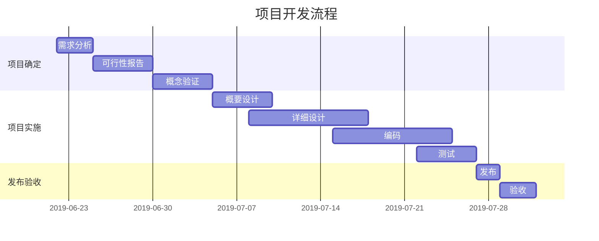

[Home](https://mengxianbin.github.io) /
[cs-notes](https://mengxianbin.github.io/cs-notes/site) /
[Language](https://mengxianbin.github.io/cs-notes/site/Language) /
[Markdown](https://mengxianbin.github.io/cs-notes/site/Language/Markdown) /
[mermaid](https://mengxianbin.github.io/cs-notes/site/Language/Markdown/mermaid)

# Mermaid

- Arya - 在线 Markdown 编辑器
  - [https://markdown.lovejade.cn/?utm_source=github.com](https://markdown.lovejade.cn/?utm_source=github.com)

- 基于 vditor

#### Flow Chart

[https://github.com/knsv/mermaid#flowchart](https://github.com/knsv/mermaid#flowchart%E2%80%B8)

#### Sequence Diagram

[https://github.com/knsv/mermaid#sequence-diagram](https://github.com/knsv/mermaid#sequence-diagram%E2%80%B8)

#### Gantt Diagram

[https://github.com/knsv/mermaid#gantt-diagram](https://github.com/knsv/mermaid#gantt-diagram%E2%80%B8)

---

