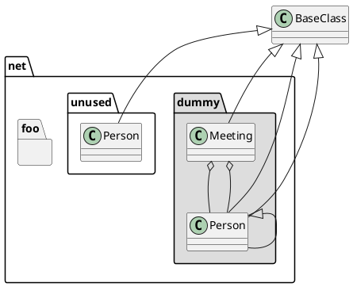

[Home](https://mengxianbin.github.io) /
[cs-notes](https://mengxianbin.github.io/cs-notes/site) /
[Language](https://mengxianbin.github.io/cs-notes/site/Language) /
[Markdown](https://mengxianbin.github.io/cs-notes/site/Language/Markdown) /
[plantuml](https://mengxianbin.github.io/cs-notes/site/Language/Markdown/plantuml) /
[Class Diagram](https://mengxianbin.github.io/cs-notes/site/Language/Markdown/plantuml/Class%20Diagram) /
[Namespaces](https://mengxianbin.github.io/cs-notes/site/Language/Markdown/plantuml/Class%20Diagram/Namespaces)

