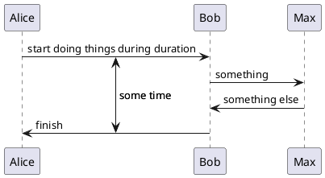

[Home](https://mengxianbin.github.io) /
[cs-notes](https://mengxianbin.github.io/cs-notes/site) /
[Language](https://mengxianbin.github.io/cs-notes/site/Language) /
[Markdown](https://mengxianbin.github.io/cs-notes/site/Language/Markdown) /
[plantuml](https://mengxianbin.github.io/cs-notes/site/Language/Markdown/plantuml) /
[Sequence Diagram](https://mengxianbin.github.io/cs-notes/site/Language/Markdown/plantuml/Sequence%20Diagram) /
[Anchors and Duration](https://mengxianbin.github.io/cs-notes/site/Language/Markdown/plantuml/Sequence%20Diagram/Anchors%20and%20Duration)

