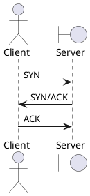

[Home](https://mengxianbin.github.io) /
[cs-notes](https://mengxianbin.github.io/cs-notes/site) /
[Network](https://mengxianbin.github.io/cs-notes/site/Network) /
[TCP](https://mengxianbin.github.io/cs-notes/site/Network/TCP) /
[connect](https://mengxianbin.github.io/cs-notes/site/Network/TCP/connect)

* three-way handshake

* Server
    * CLOSED
    * LISTEN
    * SYN_RCVD
    * ESTABLISHED

* Client
    * CLOSED
    * SYN_SENT
    * ESTABLISHED

---
