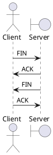

[Home](https://mengxianbin.github.io) /
[cs-notes](https://mengxianbin.github.io/cs-notes/site) /
[Network](https://mengxianbin.github.io/cs-notes/site/Network) /
[TCP](https://mengxianbin.github.io/cs-notes/site/Network/TCP) /
[terminate](https://mengxianbin.github.io/cs-notes/site/Network/TCP/terminate)

* can not send FIN and ACK together

---
