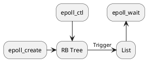

[Home](https://mengxianbin.github.io) /
[cs-notes](https://mengxianbin.github.io/cs-notes/site) /
[Operating System](https://mengxianbin.github.io/cs-notes/site/Operating%20System) /
[Linux](https://mengxianbin.github.io/cs-notes/site/Operating%20System/Linux) /
[Syscalls](https://mengxianbin.github.io/cs-notes/site/Operating%20System/Linux/Syscalls) /
[epoll](https://mengxianbin.github.io/cs-notes/site/Operating%20System/Linux/Syscalls/epoll) /
[data structure](https://mengxianbin.github.io/cs-notes/site/Operating%20System/Linux/Syscalls/epoll/data%20structure)

* RB Tree
* List

---

---
